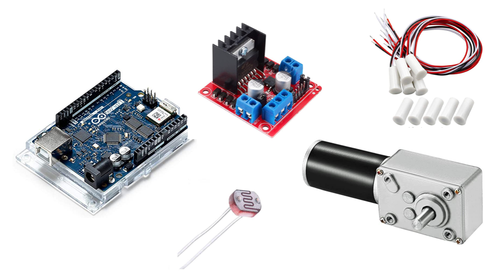

# An Automated Chicken Coop Door

HackWeek project for an automated chicken coop door to protect a flock of five chickens aquired during the dark
days of COVID from predators at night. My daughter Daniella, then 9 years old, participated enthusiastically with smart
suggestion and lots of hands on assistance.

The coop door has been operating continuously without major interruption or repair needed for about four years 
since fall 2020.

This repo primarily contains the software for the coop door in the form of an Arduino sketch.

## Threat Modeling

Using network terminology, one might be tempted to think of the outside world as the open Internet,
the chicken run as a DMZ and the inside of the chicken coop as a private enterprise LAN. 

## The Mechanical Part

## The Electrical Part

Major parts:

* Arduino UNO WiFi Rev2 board
* 12V high torque worm gear motor
* DC H bridge to power the motor via Arduino pins 
* GM5539 photo resistor 
* programmable digital timer switch
* RC-35 magentic reed switches to sense door position (up or down)
* mechanical micro switches for emergency shutdown if door hits the frame

 
## The Software

[Arduino Sketch](chicken_door.ino)

## Putting It All Together

Four modes of operation:

* photo sensor based - close door when light intensity falls below a configurable threshold and open it when it rises above a threshold
* timer based - open and clode door once a day at configurable times
* manual remote via wifi connection
* manual overide locally using a physical three-way switch

Was It Worth It? Absolutely! Priceless expereince toying with simple robotics, quality time spent with  my daughter... But seriously, was 
it worth it? Lets do some quick back of the napking calculation:

* time it takes to open the door manually (twice a day): 1 min each
* time it took to build the door 40 hours
* break even after: 3.3 years

